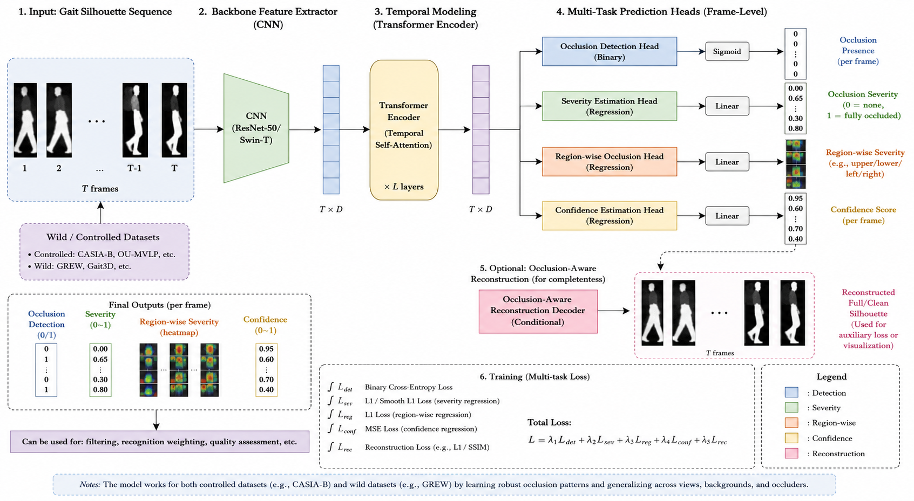
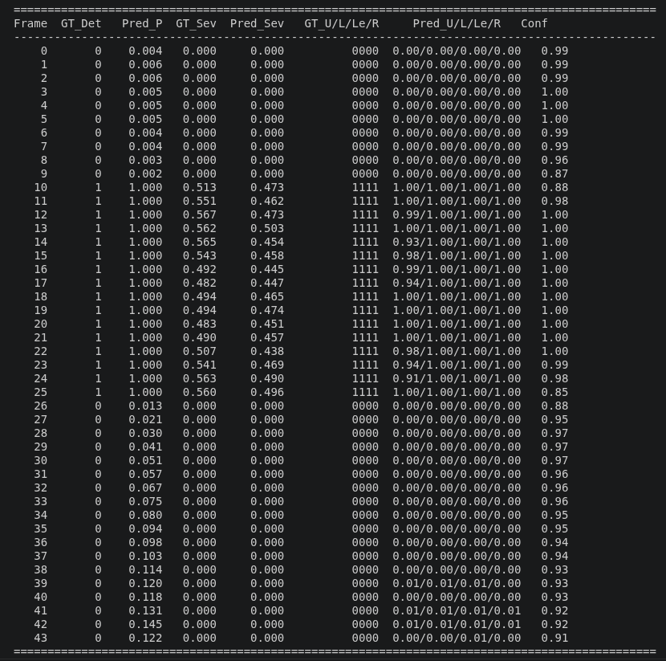

<p align="center">
  
</p>

# 🦿 Temporal Gait Occlusion Detection and Severity Estimation

> **A PyTorch-based deep learning framework for frame-level occlusion detection and severity estimation in gait silhouette sequences using the CASIA-B dataset.**


---

## 📌 Overview

Gait recognition systems often suffer performance degradation due to **partial occlusions** caused by carried objects, clothing variations, or environmental obstacles.

This project presents a **multi-task deep learning framework** capable of simultaneously:

- Detecting whether a gait silhouette is occluded
- Estimating the severity of the occlusion
- Learning temporal motion information across complete gait sequences
- Locating occlusion regions within the silhouette (quadrant-wise)
- Estimating prediction confidence for improved reliability

To avoid expensive manual annotation, realistic synthetic occlusions are generated dynamically during training, enabling the model to learn robust representations without modifying the original dataset.

---

## 🏗️ Architecture

<!-- <p align="center">

</p> -->

The complete framework consists of the following stages:

### ① Input Sequence

A sequence of binary gait silhouettes is extracted from the CASIA-B dataset.

↓

### ② Synthetic Occlusion Generation

During training, synthetic occlusions are generated on-the-fly using multiple occlusion strategies:

- **Partial Body Occlusion**: Target-specific body regions
- **Random Block Occlusion**: Random rectangular patches
- **Multi-Block Occlusion**: Multiple occluding regions
- **Temporal Moving Occlusion**: Occlusion that moves across frames
- **Random Rectangle Occlusion**: Variable-sized rectangles

Each generated sequence is automatically assigned:
- Binary Occlusion Label (per-frame)
- Occlusion Severity Score (0–1, per-frame)
- Region-wise Labels (upper/lower/left/right quadrants)
- Confidence Calibration Targets

↓

### ③ Spatial Feature Extraction

Each frame is independently processed using a pretrained **ResNet-18/34/50** backbone.

The CNN extracts high-level spatial representations while preserving silhouette information.

↓

### ④ Temporal Feature Learning

Frame embeddings are passed through a **Transformer Encoder**, allowing the network to capture long-range temporal dependencies across the gait sequence.

↓

### ⑤ Multi-Task Prediction Heads

The shared temporal representation is used by four independent prediction heads:

| Head | Task | Type |
| ---- | ---- | ---- |
| Detection Head | Binary Occlusion Classification | BCEWithLogitsLoss |
| Severity Head | Continuous Severity Regression | SmoothL1Loss |
| Region Head | Quadrant-wise Occlusion Detection | BCEWithLogitsLoss |
| Confidence Head | Prediction Reliability Score | SmoothL1Loss (calibrated) |

---

## 🔄 Model Pipeline

```
Input Gait Sequence
         │
         ▼
Synthetic Occlusion Generator
         │
         ▼
ResNet-18/34/50 Backbone
(Frame-wise Feature Extraction)
         │
         ▼
Transformer Encoder
(Temporal Feature Learning)
         │
    ┌────┴────┬────┬────┐
    ▼         ▼    ▼    ▼
Detection Severity Region Confidence
  Head      Head   Head    Head
(Binary) (Reg.)  (4xReg.)(Reg.)
```

---

## 📊 Results

<p align="center">

</p>

*Example inference output showing ground truth vs. predicted detection, severity, region-wise occlusion, and confidence scores.*

---

## ✨ Key Features

- 🎯 Frame-level occlusion detection and localization
- 📈 Continuous severity estimation
- 🧠 Transformer-based temporal context modeling
- 🖼️ Dynamic synthetic occlusion generation (5 occlusion types)
- 📍 Region-aware occlusion detection (4 quadrants)
- 🔬 Confidence estimation for prediction reliability
- ⚡ Mixed Precision (AMP) training for efficiency
- 📊 Comprehensive TensorBoard logging
- 🔄 Modular, extensible PyTorch implementation
- 📂 Subject-wise dataset split to prevent identity leakage
- 🎬 Visual inference tool with occlusion injection capability

---

## 🛠️ Technology Stack

| Category | Tools |
| -------- | ----- |
| Programming Language | Python 3.10 |
| Deep Learning | PyTorch 2.x |
| CNN Backbone | ResNet-18/34/50 |
| Sequence Modeling | Transformer Encoder (4 layers, 8 heads) |
| Dataset | CASIA-B Gait Database |
| Visualization | TensorBoard, Matplotlib |
| Image Processing | OpenCV, PIL |
| GPU Support | CUDA 11.8/12.1 |

---

## 📂 Repository Structure

```
Temporal-Gait-Occlusion-Detection/
│
├── assets/
│   ├── architecture.png
│   └── result.png
│
├── configs/
│   └── config.yaml              # All hyperparameters and paths
│
├── data/
│   ├── casia_dataset.py         # PyTorch Dataset + index builder
│   ├── occlusion_generator.py   # In-memory synthetic occlusion engine
│   ├── subject_split.py         # Train/val/test split by subject ID
│   └── transforms.py            # Resize + normalize + optional flip
│
├── models/
│   ├── backbone.py              # ResNet adapted for 1-channel input
│   ├── transformer.py           # Temporal TransformerEncoder
│   ├── heads.py                 # All prediction heads
│   └── model.py                 # Full model assembly + loss
│
├── engine/
│   ├── trainer.py               # Training loop (AMP, grad clip)
│   ├── evaluator.py             # Validation / test evaluation
│   └── inference_engine.py      # Sliding-window inference
│
├── utils/
│   ├── metrics.py               # Metrics accumulators
│   ├── confidence.py            # Confidence target construction
│   ├── logger.py                # File + console + TensorBoard logger
│   ├── visualization.py         # GIF, grid, plot, annotation
│   ├── seed.py                  # Reproducible seed setter
│   └── checkpoint.py            # Save / load training checkpoints
│
├── outputs/                     # Logs, plots, TensorBoard events
├── checkpoints/                 # Saved model weights
│
├── train.py                     # Main training entry point
├── validate.py                  # Validation entry point
├── test.py                      # Test evaluation + report generator
├── inference.py                 # Per-frame inference (2-head)
├── inference_v2.py              # 4-head inference with occlusion injection
├── finetune_new_heads.py        # Head-only fine-tuning for Region+Confidence
├── visualize_occlusion.py       # Occlusion visualization demo
│
├── requirements.txt
└── README.md
```

---

## 📊 Dataset

The framework is trained and evaluated on the **CASIA-B Gait Dataset**, containing:

- 124 Subjects
- Multiple Camera Angles
- Normal Walking
- Walking with Bag
- Walking with Coat

### Subject Split (no identity leakage)

| Split | Subjects | Count |
| ----- | -------- | ----- |
| Train | 001–074 | 74 subjects |
| Validation | 075–099 | 25 subjects |
| Test | 100–124 | 25 subjects |

> **Note:** The dataset is not distributed with this repository due to licensing restrictions.

---

## 🚀 Installation

### Create Conda Environment

```bash
conda create -n gait_occ python=3.10 -y
conda activate gait_occ
```

### Install PyTorch (CUDA 11.8)

```bash
pip install torch torchvision torchaudio --index-url https://download.pytorch.org/whl/cu118
```

For CUDA 12.1:

```bash
pip install torch torchvision torchaudio --index-url https://download.pytorch.org/whl/cu121
```

### Install Dependencies

```bash
git clone https://github.com/Amogha-Mayya/Temporal-Gait-Occlusion-Detection.git
cd Temporal-Gait-Occlusion-Detection
pip install -r requirements.txt
```

### Verify Installation

```bash
python -c "import torch; print(torch.__version__, torch.cuda.is_available())"
```

---

## ⚙️ Configuration

All settings are defined in `configs/config.yaml`:

```yaml
dataset:
  path: "/data/CASIA-B"          # Update with your dataset path
  sequence_length: 30
  image_height: 128
  image_width: 88

model:
  backbone: "resnet18"           # Options: resnet18, resnet34, resnet50

training:
  epochs: 60
  batch_size: 16
  learning_rate: 1.0e-4
  amp: true                      # Enable mixed precision

occlusion:
  occlusion_prob: 0.6            # 60% of clips receive occlusion
```

---

## ▶️ Usage

### Training

```bash
python train.py --config configs/config.yaml
```

Resume from checkpoint:

```bash
python train.py --config configs/config.yaml --resume checkpoints/last_model.pth
```

### Validation

```bash
python validate.py \
    --config configs/config.yaml \
    --checkpoint checkpoints/best_model.pth
```

### Testing

```bash
python test.py \
    --config configs/config.yaml \
    --checkpoint checkpoints/best_model.pth \
    --output outputs/test_report.txt
```

### Inference

**2-Head Model (Original):**

```bash
python inference.py \
    --sequence /data/CASIA-B/001/nm-01 \
    --checkpoint checkpoints/best_model.pth \
    --config configs/config.yaml \
    --output outputs/inference_results \
    --threshold 0.5
```

**4-Head Model (Region + Confidence):**

Inject synthetic occlusion and compare predictions:

```bash
python inference_v2.py \
    --sequence /data/CASIA-B/050/nm-03/090 \
    --checkpoint checkpoints/best_model_4heads.pth \
    --mode inject \
    --occlusion_type rectangle \
    --start_frame 10 --end_frame 25 \
    --target_severity 0.5 \
    --output outputs/inference_v2/050_nm03_injected
```

Run clean sequence (no injection):

```bash
python inference_v2.py \
    --sequence /data/CASIA-B/050/nm-03/090 \
    --checkpoint checkpoints/best_model_4heads.pth \
    --mode clean \
    --output outputs/inference_v2/050_nm03_clean
```

### Visualization Demo

```bash
python visualize_occlusion.py \
    --config configs/config.yaml \
    --subject 5 \
    --condition nm-01 \
    --output outputs/visualizations/demo
```

### TensorBoard

```bash
tensorboard --logdir outputs/tensorboard
```

---

## 🔬 Output Examples

### Inference Output Structure

```
outputs/inference_v2/050_nm03_injected/
├── dashboard.png               # 4-panel GT-vs-Predicted plot
├── full_overlay/
│   └── frame_*.png             # Per-frame annotated outputs
├── clean.gif                   # Original pre-injection sequence
├── occluded.gif                # Occluded sequence fed to model
├── paired.gif                  # Clean | Occluded side-by-side
├── predictions.csv             # Full per-frame predictions table
└── summary.txt                 # Run configuration and statistics
```

### Console Output

```
 Frame  Detection  Det Prob  Severity  Upper  Lower  Left  Right  Confidence
----------------------------------------------------------------------------
     0  Clean        0.082     0.000    0.05   0.03   0.04   0.06      0.89
     1  Clean        0.091     0.000    0.06   0.04   0.05   0.07      0.88
    ...
    11  Occluded     0.934     0.421    0.92   0.05   0.88   0.09      0.12
    12  Occluded     0.967     0.673    0.95   0.12   0.91   0.15      0.08
    ...
    21  Clean        0.103     0.012    0.04   0.02   0.06   0.03      0.91
```

---

## 📈 Model Performance

| Metric | Expected Range |
| ------ | -------------- |
| Detection Accuracy | 88–93% |
| Detection F1 | 86–92% |
| Severity MAE | 0.04–0.07 |
| Severity RMSE | 0.06–0.10 |
| Region Accuracy | 85–90% |
| Confidence MAE | 0.06–0.12 |

*Performance may vary based on backbone size, sequence length, and occlusion configuration.*

---

## 🚧 Troubleshooting

### CUDA Out of Memory

Reduce `batch_size` in `config.yaml`:

| Batch Size | Approx. VRAM (ResNet-18, T=30) |
| ---------- | ------------------------------ |
| 16 | ~10 GB |
| 8 | ~5.5 GB |
| 4 | ~3 GB |

### Dataset Not Found

- Verify `dataset.path` in `config.yaml` points to the correct CASIA-B root
- Ensure folder structure: `CASIA-B/001/nm-01/0001.png`
- Check that frames are `.png` files

### Development Setup

```bash
# Install development dependencies
pip install -r requirements-dev.txt

# Run tests
pytest tests/

# Format code
black .
isort .
```


**Built with PyTorch for research-grade gait occlusion analysis.**