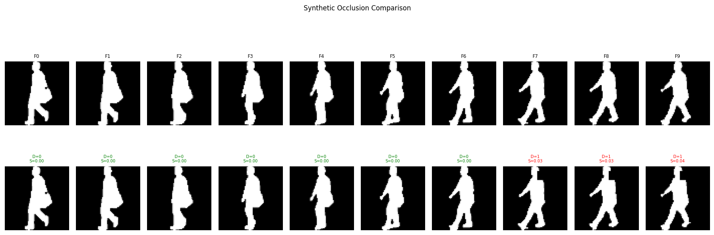

# 🦿 Temporal Gait Occlusion Detection and Severity Estimation

> Deep Learning framework for **frame-level occlusion detection** and **severity estimation** in gait silhouette sequences using the **CASIA-B** dataset.


---

# 📖 Project Overview

Occlusions such as bags, coats, and partial body visibility significantly affect the performance of gait-based biometric systems. This project proposes a deep learning framework that automatically detects whether each frame in a gait sequence is occluded and estimates the severity of the occlusion.

Instead of manually annotating thousands of samples, synthetic occlusions are generated dynamically during training, allowing the model to learn robust temporal representations without modifying the original dataset.

---

# 🏗️ Model Architecture

<p align="center">
    
</p>

The proposed pipeline consists of:

1. **Input Gait Silhouette Sequence**
2. **Synthetic Occlusion Generation**
3. **CNN Backbone (ResNet-18)**
4. **Temporal Transformer Encoder**
5. **Occlusion Detection Head**
6. **Occlusion Severity Regression Head**

---

# ✨ Key Features

- ✅ Frame-level occlusion detection
- ✅ Occlusion severity estimation (0–1 scale)
- ✅ Synthetic occlusion generation during training
- ✅ Transformer-based temporal modeling
- ✅ Subject-wise train/validation/test split
- ✅ Mixed Precision (AMP) training
- ✅ TensorBoard visualization
- ✅ Modular PyTorch implementation

---

# 🔄 Pipeline

```
Input Sequence
       │
       ▼
Synthetic Occlusion Generator
       │
       ▼
ResNet-18 Feature Extractor
       │
       ▼
Transformer Encoder
       │
       ├───────────────┐
       ▼               ▼
Detection Head    Severity Head
(Binary)          (Regression)
```

---

# 🧠 Tech Stack

| Category | Technologies |
|----------|--------------|
| Language | Python |
| Framework | PyTorch |
| Backbone | ResNet-18 |
| Temporal Model | Transformer Encoder |
| Dataset | CASIA-B |
| Visualization | TensorBoard, Matplotlib |
| GPU | CUDA |
| Image Processing | OpenCV |

---

# 📂 Repository Structure

```
Temporal-Gait-Occlusion-Detection/
│
├── assets/
│   └── architecture.png
│
├── configs/
├── data/
├── models/
├── utils/
├── checkpoints/
├── outputs/
│
├── train.py
├── validate.py
├── test.py
├── inference.py
├── requirements.txt
└── README.md
```

---

# 📊 Dataset

This project uses the **CASIA-B Gait Dataset**, one of the most widely used datasets for gait recognition research.

The dataset contains:

- 124 subjects
- Multiple viewing angles
- Normal walking
- Walking with a bag
- Walking with a coat

> **Note:** The dataset is **not included** in this repository due to licensing restrictions.

---

# 🚀 Installation

Clone the repository

```bash
git clone https://github.com/Amogha-Mayya/Temporal-Gait-Occlusion-Detection.git

cd Temporal-Gait-Occlusion-Detection
```

Install dependencies

```bash
pip install -r requirements.txt
```

---

# ⚙️ Training

```bash
python train.py
```

---

# 🔍 Validation

```bash
python validate.py
```

---

# 🧪 Testing

```bash
python test.py
```

---

# 🎯 Inference

```bash
python inference.py
```

---

# 📈 Model Outputs

The model predicts:

- Binary Occlusion Detection
- Occlusion Probability
- Occlusion Severity Score (0–1)

---

# 📸 Sample Outputs

You can add sample prediction images here.

<p align="center">

</p>

---

# 📌 Future Improvements

- Vision Transformer backbone
- Real-world occlusion datasets
- Multi-task learning
- Real-time deployment
- Lightweight mobile inference
